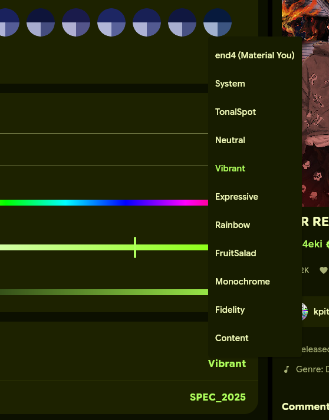
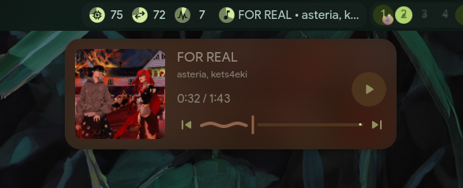
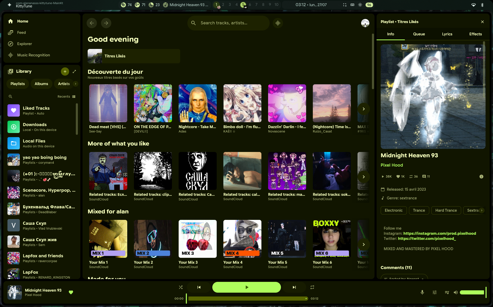
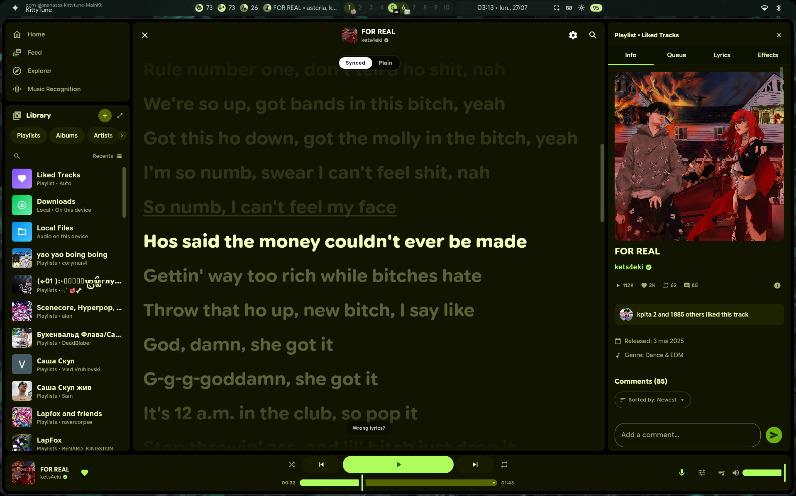
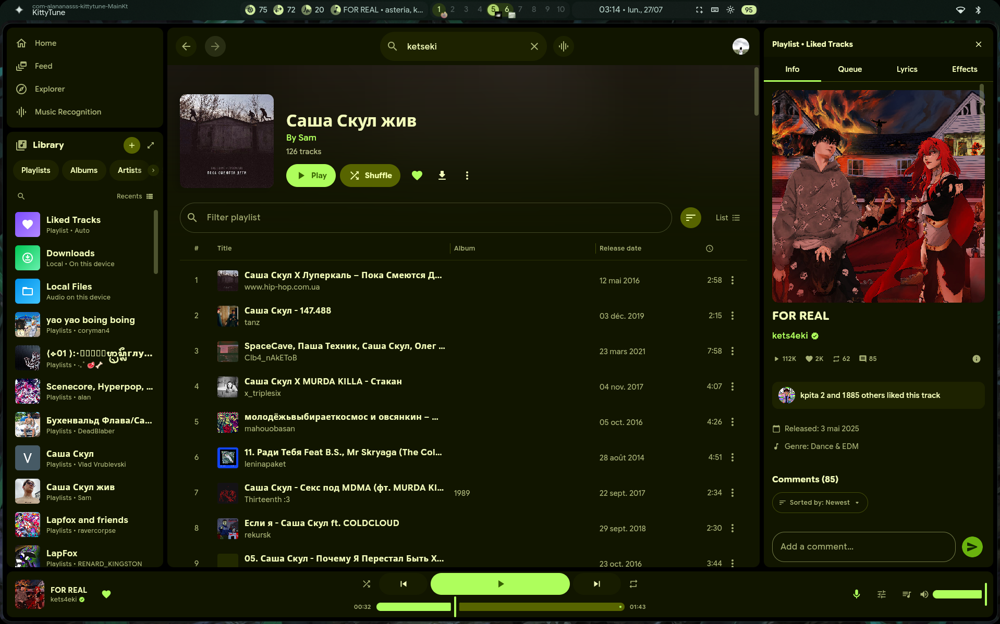

<p align="center">
  
</p>

<h1 align="center">KittyTune Desktop (・∀・)ﾉ</h1>

<p align="center">
  <a href="https://github.com/alan7383/KittyTuneDesktop/blob/master/LICENSE">
    
  </a>
  <a href="https://github.com/alan7383/KittyTuneDesktop/releases">
    
  </a>
  
  
  
</p>

<p align="center">
  <strong>A full desktop port of KittyTune Android for Linux, Windows, and macOS.</strong><br>
  SoundCloud-first music streaming with full account & likes synchronization, YouTube fallback, zero ads, synchronized lyrics, MPRIS media controls, Discord RPC, and native Material You end4 dotfiles integration.
</p>

---

### ~ what is this

KittyTune Desktop is a complete, native desktop port of the KittyTune Android music application. Built from the ground up using **Kotlin 2.4.0**, **Compose Multiplatform (Skiko)**, and **Material 3 Expressive**, it brings the full mobile experience natively to Linux, Windows, and macOS desktops.

Instead of running heavy web wrappers (Electron or Chromium PWA), KittyTune Desktop operates as a lightweight JVM desktop client. It streams high-quality audio with **SoundCloud as its primary music source** (including complete account synchronization for likes, reposts, and playlists just like the official SoundCloud player) and **YouTube as an automatic fallback**, renders real-time synchronized karaoke lyrics, offers a **true full-playlist shuffle** without lazy-loading limits, integrates with system media controls (MPRIS / SMTC), and seamlessly synchronizes with system-wide Material You themes.

---

### * features

<details open>
<summary><b>~ audio streaming & soundcloud account sync</b></summary>

*   **Full SoundCloud account synchronization**: Connect your SoundCloud account to automatically sync all your liked tracks, user playlists, reposts, and listening history in real time—just like using the official SoundCloud player.
*   **SoundCloud-first audio streaming**: Native SoundCloud audio playback engine with seamless YouTube audio fallback when required.
*   **High-fidelity audio engine**: Built-in FFmpeg and JavaFX Media playback pipelines with buffer optimization and gapless playback.
*   **Audio crossfade**: Smooth track transitions with customizable crossfade duration between songs.
*   **Search & discovery**: Instant search across tracks, artists, albums, and playlists with rich suggestion filters.
*   **True full-playlist shuffle**: Shuffles your entire playlist instantly, bypassing the frustrating "lazy load shuffle" bug present in the official SoundCloud Web player.
*   **History & stats**: Local listening history, stats tracking, and automatic play counter persistence.
</details>

<details>
<summary><b>> synchronized lyrics & visuals (not in soundcloud web)</b></summary>

*   **Real-time synchronized lyrics**: Powered by LrcLib and KuGou scrapers with word-by-word / line-by-line karaoke highlights (feature absent from official SoundCloud Web).
*   **Variable font customization**: Fine-tune variable typography parameters (font weight, width, slant, roundness, opsz, and grade).
*   **Immersive player UI**: Dynamic player colors matching current album artwork.
</details>

<details>
<summary><b>+ desktop integration & controls</b></summary>

*   **Linux MPRIS D-Bus integration**: Full integration with Linux desktop panels (Waybar, Quickshell, KDE, GNOME) for play, pause, skip, track metadata, and album art display.
*   **Windows & macOS system media controls**: Native media key support and system overlay controls.
*   **Discord Rich Presence (RPC)**: Broadcast your currently playing music to Discord with album artwork and time elapsed.
*   **Global keyboard shortcuts**: Control playback instantly with customizable hotkeys across your desktop workspace.
</details>

<details>
<summary><b># end4 hyprland dotfiles & material you system theme</b></summary>

*   **Automatic end4 dotfile detection**: Automatically detects if [end4's Hyprland dotfiles](https://github.com/end-4/dots-hyprland) are installed on your Linux system.
*   **Exclusive theme option**: Unlocks the dedicated `end4 (Material You)` palette style in Settings -> Theme.
*   **Real-time live reloading**: Listens to `matugen` color updates in `~/.local/state/quickshell/user/generated/colors.json`. KittyTune Desktop updates its entire color scheme live without restart.
*   **Pure black AMOLED mode**: True `#000000` background toggle for OLED displays.
</details>

---

### > end4 hyprland dotfiles & material you system integration

KittyTune Desktop integrates natively with [end4's Hyprland dotfiles](https://github.com/end-4/dots-hyprland). 

Since both KittyTune Desktop and the end4 dotfiles (`illogical-impulse`) are built around **Material 3 (Material You / Monet)**, they work perfectly together to provide seamless system-wide color harmony.

When end4 dotfiles are detected on your system, KittyTune Desktop unlocks an exclusive **`end4 (Material You)`** palette option in Settings. It automatically reads color tokens generated by `matugen` and updates its colors live whenever you change your wallpaper.

<p align="center">
  
  <br><em>The exclusive end4 (Material You) palette option.</em>
  <br><br>
  
  <br><em>Quickshell MPRIS media control panel integration.</em>
</p>

---

### + screenshots

<p align="center">
  
  <br><em>Main Home Screen displaying user library, recommendations, and recent tracks.</em>
</p>

<br>

<p align="center">
  
  <br><em>Synchronized Karaoke Lyrics view with real-time playback tracking.</em>
</p>

<br>

<p align="center">
  
  <br><em>Playlist view with track listings, duration, and batch playback controls.</em>
</p>

---

### * keyboard shortcuts

| Shortcut | Action |
| :--- | :--- |
| `Spacebar` | Play / Pause toggle |
| `N` / `Shift + Right` | Next track |
| `P` / `Shift + Left` | Previous track |
| `L` | Toggle Like / Favorite |
| `R` | Toggle Repeat mode |
| `S` | Toggle Shuffle mode |
| `Shift + Up` | Increase Volume |
| `Shift + Down` | Decrease Volume |
| `M` | Mute / Unmute audio |
| `Escape` | Navigate back / Close modal |

---

### # download & installation

Pre-built binaries for Linux, Windows, and macOS are available on the [Releases page](https://github.com/alan7383/KittyTuneDesktop/releases).

#### **arch linux (aur & pkg)**
Install the standalone pacman package:

```bash
sudo pacman -U kitty-tune-1.0.17-1-x86_64.pkg.tar.zst
```

#### **debian / ubuntu / linux mint (.deb)**
Install using `apt`:

```bash
sudo apt install ./kitty-tune_1.0.17_amd64.deb
```

#### **fedora / opensuse / rhel (.rpm)**
Install using `dnf`:

```bash
sudo dnf install ./kitty-tune-1.0.17-1.x86_64.rpm
```

#### **universal portable linux (.AppImage)**
Make executable and run directly on any distro:

```bash
chmod +x KittyTune-1.0.17-x86_64.AppImage
./KittyTune-1.0.17-x86_64.AppImage
```

#### **windows & macos**
Grab the Windows installer (`.msi`), portable archive (`.zip`), or macOS disk image (`.dmg`).

---

### % building from source

#### **prerequisites**
*   JDK 21 or higher
*   Git

```bash
# Clone repository
git clone https://github.com/alan7383/KittyTuneDesktop.git
cd KittyTuneDesktop

# Run desktop application
./gradlew run

# Package distribution for your operating system
./gradlew packageDistributionForCurrentOS
```

---

### ? why kittytune desktop? (kittytune vs soundcloud web)

Most desktop music streaming clients are heavy Electron applications that consume gigabytes of RAM. KittyTune Desktop was created as a native, lightweight alternative that runs smoothly with minimal CPU and memory footprint, while providing advanced features that the official SoundCloud Web player lacks:

| Feature | Official SoundCloud Web | KittyTune Desktop |
| :--- | :--- | :--- |
| **True full-playlist shuffle** | No (Limited by lazy-loaded tracks) | Yes (Shuffles the entire playlist instantly) |
| **Offline music downloads** | No (Requires Go+ subscription) | Yes (Free offline caching & local files) |
| **Ad-free experience** | No (Audio/video ads without Go+) | Yes (100% ad-free) |
| **Synchronized karaoke lyrics** | No (Absent) | Yes (LrcLib & KuGou word/line tracking) |
| **Audio crossfade** | No (Absent) | Yes (Smooth track transitions with customizable duration) |
| **YouTube audio fallback** | No (Stream fails if missing) | Yes (Automatic audio stream routing) |
| **System-wide theme sync** | No (Fixed web UI) | Yes (end-4 Hyprland / matugen live hot-reload) |
| **Native Linux MPRIS D-Bus** | No (Browser session dependent) | Yes (Full panel & Waybar media integration) |
| **Discord Rich Presence (RPC)** | No (Requires 3rd party apps) | Yes (Native Discord status & artwork) |

---

### * credits & license

*   Based on KittyTune for Android.
*   Material You color system powered by [end-4/dots-hyprland](https://github.com/end-4/dots-hyprland) and `matugen`.
*   Built with [Compose Multiplatform](https://github.com/JetBrains/compose-multiplatform) and [MaterialKolor](https://github.com/aj-alt/MaterialKolor).

Licensed under the **MIT License**.

---

<p align="center">
  made with ( ˘▽˘)っ♨ and a bit of chaos by <a href="https://github.com/alan7383">alan7383</a> (´･ω･`)
</p>
