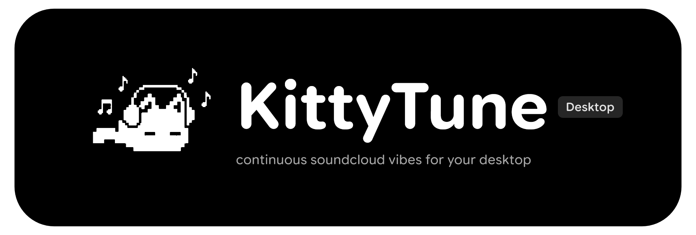

<p align="center">
  
</p>

<h1 align="center">KittyTune Desktop (・∀・)ﾉ</h1>

<p align="center">
  <a href="https://github.com/alan7383/KittyTuneDesktop/releases">
    
  </a>
  
  
  
  <a href="https://github.com/alan7383/KittyTuneDesktop/blob/master/LICENSE">
    
  </a>
</p>

<p align="center">
  <strong>A lightweight, native desktop music player for Linux, Windows, and macOS.</strong><br>
  SoundCloud-first streaming with full account sync, lossless upgrades (Qobuz, TIDAL, Deezer), Apple-style karaoke lyrics, DJ Automix & a 30+ audio effects studio.
</p>

---

> [!NOTE]
> **linux-first project**: KittyTune Desktop is developed and tested primarily on **Linux**. Builds for **Windows** and **macOS** are provided but are currently **experimental** and may experience rough edges, glitches, or missing platform-specific behaviors. If you encounter bugs on Windows or macOS, please feel free to [open an issue](https://github.com/alan7383/KittyTuneDesktop/issues) or submit a Pull Request! (´･ω･`)

---

### ~ what is this

KittyTune Desktop is a complete, native desktop music player built from scratch with **Kotlin 2.4.20**, **Compose Multiplatform**, and **Material 3 Expressive**, designed primarily for Linux systems.

No heavy web wrappers or Electron bloat here. Just a fast, lightweight JVM client that streams directly from **SoundCloud** (with full account sync for likes, reposts, and playlists), automatically upgrades to **Qobuz (Hi-Res Lossless)**, **TIDAL (FLAC)**, **Deezer**, or **YouTube Music** when available, renders live Apple-style karaoke lyrics, mixes transitions with DJ Automix, and features an integrated 30+ effects audio DSP rack.

---

### * features

<details open>
<summary><b>~ soundcloud-first streaming & account sync</b></summary>

* **full soundcloud account sync**: link your account to sync liked tracks, playlists, reposts, and history in real time.
* **true full-playlist shuffle**: shuffles your entire library or playlist at once — no lazy-load limits or repeated tracks.
* **zero ads & continuous vibes**: pure audio streaming without banner, audio, or video ads.
* **search & discovery**: instant search across tracks, artists, albums, and playlists with instant filters.
* **history & listening stats**: local playback history, play counts, and listening statistics persistence.
</details>

<details>
<summary><b>> lossless upgrades & multi-provider engine</b></summary>

* **smart isrc resolver**: automatically resolves tracks to high-fidelity studio sources.
* **multi-source priority**: customize streaming order between Qobuz (Hi-Res Lossless), TIDAL (FLAC), Deezer (HQ), YouTube Music, and SoundCloud.
* **automatic fallback**: seamlessly switches to alternative providers if a track is unavailable or region-locked.
</details>

<details>
<summary><b>+ synchronized lyrics & apple-style karaoke</b></summary>

* **real-time synchronized lyrics**: syllable-level and word-by-word karaoke tracking powered by LrcLib and KuGou scrapers.
* **duet singer detection**: automatically identifies multi-artist tracks and displays lyrics split to the left and right sides.
* **variable font tuning**: customize font weight, width, slant, roundness, optical size, and grade for lyrics typography.
* **accompanist animations**: smooth spring rebound animations, blur transitions, and per-track manual sync offset persistence.
</details>

<details>
<summary><b># dj automix & 30+ audio fx studio</b></summary>

* **automix dj transitions**: beat and tempo-aware crossfades with customizable transition offsets (Auto, 0:00, or slider) and ambient slider glow.
* **power eq & dynamics**: bass boost, sub-octaver, tape saturation, vocal boost, vocal remover, and peak limiter normalization.
* **spatial & ambience fx**: 8d audio, super wide, shimmer reverb, empty mall, stadium, and reverse echo.
* **lo-fi & vintage filters**: vinyl lo-fi, vintage mp3, walkman, gramophone, chiptune, and robot vocoder.
* **ambient rain mixer**: overlay adjustable ambient rain sounds directly on top of your audio.
* **timestretcher engine**: precise speed, pitch, and tempo adjustment without audio degradation.
</details>

<details>
<summary><b>* mini-player & expressive desktop ui</b></summary>

* **floating mini-player**: transparent elongated bar or compact floating widget with always-on-top mode, hover actions, and inline lyrics.
* **expressive material 3**: fluid animated mesh backgrounds adapting to album cover colors, expressive wavy/squiggly progress sliders.
* **music recognition (shazamkit)**: identify playing songs instantly with integrated Shazam recognition and history tracking.
</details>

<details>
<summary><b>= linux integration & media controls</b></summary>

* **linux mpris d-bus integration**: native media controls for Waybar, Quickshell, KDE, GNOME, and Linux desktop panels.
* **dynamic wallpaper color sync**: seamless color adaptation matching system accent tokens (Matugen / Material You).
* **discord rich presence (rpc)**: show off your currently playing music, artist, elapsed time, and high-res album artwork on Discord.
* **modern system tray**: custom themed tray context menu with quick playback toggles and volume control.
* **customizable global shortcuts**: control playback, volume, and tracks anywhere on your desktop.
</details>

---

### + screenshots

<p align="center">
  
  <br><em>fullscreen player — fluid artwork canvas, expressive wavy sliders, and dynamic colors.</em>
</p>

<br>

<p align="center">
  
  <br><em>synchronized lyrics — real-time karaoke tracking, accompanist animations, and duet singer split.</em>
</p>

<br>

<p align="center">
  
  <br><em>audio fx studio — 30+ modular dsp effects, bass boost, 8d audio, and rain mixer.</em>
</p>

<br>

<p align="center">
  
  <br><em>floating mini-player — transparent elongated bar with hover controls and live lyrics.</em>
</p>

<br>

<p align="center">
  
  <br><em>home screen — soundcloud stream, likes, playlists, and user library.</em>
</p>

---

### * keyboard shortcuts

<details>
<summary><b>> click to view all keyboard shortcuts</b></summary>

<br>

#### **playback & track controls**

| shortcut | action |
| :--- | :--- |
| `Spacebar` | play / pause toggle |
| `Shift + Right` | play next track |
| `Shift + Left` | play previous track |
| `Right` | seek forward (+5 seconds) |
| `Left` | seek backward (-5 seconds) |
| `0` ... `9` | seek to percentage (0% to 90% of track) |
| `Shift + L` | toggle repeat mode |
| `Shift + S` | toggle shuffle mode |
| `L` | like / unlike playing track |
| `R` | repost / un-repost playing track |

#### **volume & audio**

| shortcut | action |
| :--- | :--- |
| `Shift + Up` | increase volume |
| `Shift + Down` | decrease volume |
| `M` | mute / unmute volume |

#### **navigation & panels**

| shortcut | action |
| :--- | :--- |
| `S` | open search field |
| `P` | navigate to playing track details |
| `Q` | toggle next up queue panel |
| `H` | open keyboard shortcuts modal |
| `Escape` | close overlay / navigate back |
| `Mouse Back / Forward` | history back / forward navigation |
| `G` then `L` | navigate to likes |
| `G` then `C` | navigate to library |
| `G` then `H` | navigate to history |
| `G` then `S` | navigate to feed (stream) |
| `G` then `P` | navigate to profile |

#### **ui zoom & scaling**

| shortcut | action |
| :--- | :--- |
| `Ctrl + +` / `Ctrl + =` | zoom in (increase ui scale) |
| `Ctrl + -` | zoom out (decrease ui scale) |
| `Ctrl + 0` | reset ui zoom to 100% |

</details>

---

### # download & installation

pre-built binaries for linux, windows, and macos are available on the [**releases page**](https://github.com/alan7383/KittyTuneDesktop/releases).

| Platform / Distribution | Method | Command / Package |
| :--- | :--- | :--- |
| **Arch Linux** | [AUR (`kitty-tune-bin`)](https://aur.archlinux.org/packages/kitty-tune-bin) | `yay -S kitty-tune-bin` |
| **Arch Linux** | Pacman package | `sudo pacman -U kitty-tune-*.pkg.tar.zst` |
| **Debian / Ubuntu / Mint** | Debian package (`.deb`) | `sudo apt install ./kitty-tune_*_amd64.deb` |
| **Fedora / RHEL / openSUSE** | RPM package (`.rpm`) | `sudo dnf install ./kitty-tune-*.rpm` |
| **Universal Linux** | Standalone AppImage | `chmod +x KittyTune-*.AppImage && ./KittyTune-*.AppImage` |
| **Windows & macOS** | Installer / DMG *(Experimental)* | [GitHub Releases](https://github.com/alan7383/KittyTuneDesktop/releases) |

<br>

#### **arch linux**

##### **option 1: aur (recommended)**
the package [**`kitty-tune-bin`**](https://aur.archlinux.org/packages/kitty-tune-bin) is available on the Arch User Repository (AUR), maintained by [@Felitendo](https://github.com/Felitendo).

install with **yay**:
```bash
yay -S kitty-tune-bin
```

or with **paru**:
```bash
paru -S kitty-tune-bin
```

> [!NOTE]
> The AUR package is maintained independently by Felitendo. As with any AUR package, you can inspect the [`PKGBUILD`](https://aur.archlinux.org/cgit/aur.git/tree/PKGBUILD?h=kitty-tune-bin) before installing.

##### **option 2: official pacman package (`.pkg.tar.zst`)**
download the latest `.pkg.tar.zst` archive directly from [**releases**](https://github.com/alan7383/KittyTuneDesktop/releases) and install via `pacman`:

```bash
sudo pacman -U kitty-tune-*.pkg.tar.zst
```

---

#### **debian / ubuntu / linux mint (`.deb`)**
download the `.deb` file from the [**releases page**](https://github.com/alan7383/KittyTuneDesktop/releases) and install via `apt`:

```bash
sudo apt install ./kitty-tune_*_amd64.deb
```

---

#### **fedora / opensuse / rhel (`.rpm`)**
download the `.rpm` file from the [**releases page**](https://github.com/alan7383/KittyTuneDesktop/releases) and install via `dnf`:

```bash
sudo dnf install ./kitty-tune-*.rpm
```

---

#### **universal portable linux (`.AppImage`)**
download the standalone `.AppImage` from the [**releases page**](https://github.com/alan7383/KittyTuneDesktop/releases):

```bash
chmod +x KittyTune-*.AppImage
./KittyTune-*.AppImage
```

---

#### **windows & macos (experimental)**
grab pre-compiled installers directly from the [**releases page**](https://github.com/alan7383/KittyTuneDesktop/releases):
* **windows**: installer (`.msi`) or portable archive (`.zip`)
* **macos**: disk image (`.dmg`)

---

### % building from source

#### **prerequisites**
* JDK 21 or higher
* Git

```bash
# clone repo & navigate
git clone https://github.com/alan7383/KittyTuneDesktop.git
cd KittyTuneDesktop

# run application
./gradlew run

# package binary for your OS
./gradlew packageDistributionForCurrentOS
```

---

### ? why kittytune desktop? (kittytune vs soundcloud web)

most desktop music clients are heavy electron apps that gobble up gigabytes of RAM. KittyTune Desktop was created as a native, lightweight alternative that runs smoothly with low CPU and memory footprint, while providing features the official web player misses out on:

| feature | official soundcloud web | kittytune desktop |
| :--- | :--- | :--- |
| **platform focus** | browser | linux-first native desktop client |
| **true full-playlist shuffle** | no (limited by lazy loading) | yes (instant full shuffle) |
| **lossless upgrades (qobuz, tidal, deezer)** | no (128kbps mp3 / 256kbps aac) | yes (automatic isrc hi-res lossless matching) |
| **ad-free experience** | no (audio/video ads) | yes (100% ad-free) |
| **apple-style synced lyrics** | no | yes (lrcLib & kugou word/line sync + duet split) |
| **dj automix & 30+ dsp fx** | no | yes (beat-matched transitions & studio rack) |
| **floating mini-player** | no | yes (transparent bar with inline lyrics) |
| **song recognition (shazam)** | no | yes (built-in shazamkit recognition) |
| **system-wide theme sync** | no (fixed web UI) | yes (live matugen / wallpaper color sync) |
| **native linux mpris d-bus** | no | yes (full panel & waybar controls) |
| **discord rich presence (rpc)** | no (needs 3rd party extension) | yes (native discord status & cover art) |

---

### * credits & license

* based on KittyTune for Android.
* built with [Compose Multiplatform](https://github.com/JetBrains/compose-multiplatform), [MaterialKolor](https://github.com/jordond/MaterialKolor), and [FFmpeg](https://ffmpeg.org/).

licensed under the **MIT License**.

---

### ^ contributors

thanks to everyone who helps make KittyTune Desktop better:

[](https://github.com/alan7383/KittyTuneDesktop/graphs/contributors)


---

<p align="center">
  made with ( ˘▽˘)っ♨ and a bit of chaos by <a href="https://github.com/alan7383">alan7383</a> (´･ω･`)
</p>
